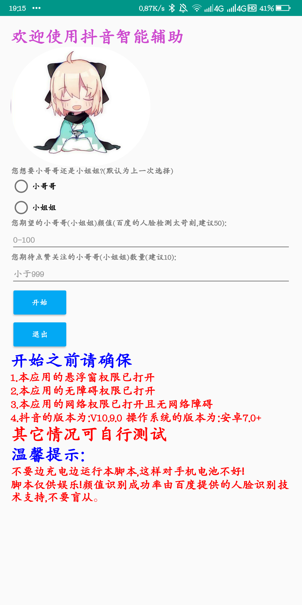
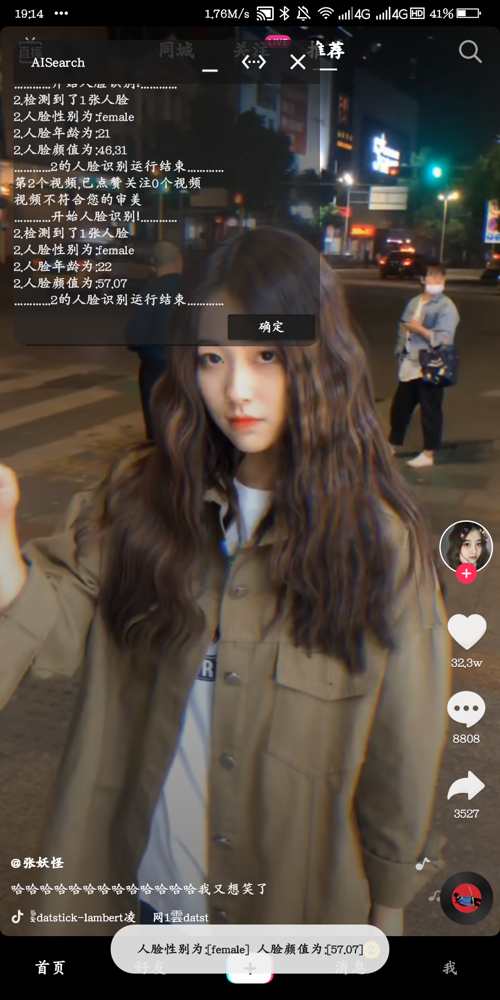

# 抖音智能辅助（人脸检测）

> 用 AutoJs 写的抖音人脸颜值检测脚本

## ~~项目无期限延更，想要用的可以下载源码，修改.dat 数据文件里面的控件 id，重新打包成 apk 运行。项目终止于抖音版本 V11.3.0~~

## 2022-06-04-创建V9版本

- V9来了，咱也抽空升个级吧

## 2022-01-08-船新版本 🚀

- 好神奇-改成`matchTemplate`后找图可以用了。
- 理所当然,它可以识图啦, 麻麻再也不用担心我抓不到控件id了
- 本次更新还引入了一些第三方插件-比如ocr,再比如pytorch
- 偷偷告诉你，opencv它也一直都在
- 但是这些暂时都没有用上
- 以后...

## 2021-10-09-一次代码发布 🚀

**~~由于我误解了官方文档内 `Canvas` 的使用，同时也高估了官方 `findImage` 的找图效率,本次代码更新仅供学习参考, 不能直接使用，未来可能会尝试插件找图方式~~**

## 2021-09 一次偷偷的更新前测试 🚀

> 👋 久等了！没想到一个一时兴起的想法能收获几十个 star! 感谢 🙏‍!

- [x] 去除本地存储，所有选项信息改为存在本地数据库中

- [x] 将由 id 获取控件升级为找图获取控件, 以后不必自己找 id 再改 id 了, 也不会不更新就不能用了(理论上)

- [x] 更智能的找图算法(其实啥也没动):

  - 单个视频缩短两次识别等待时间(不超过 5s)

  - 增加自定义单个视频识别时间

  - 增加本地识图与百度识图结合的方式

- [x] 更合理的目录结构(其实一直不想更新就是因为当时写的不忍直视)

- [x] 更丰富的功能(彩蛋)(再说再说,来日方长!)

- [x] 更健康的代码(人总要成长的嘛, 辣鸡代码早晚要重构掉!)

## 2020-5-26

---

- [x] ~~支持控件信息更新~~更新个 der,咱不用再更新控件了！

## 支持功能

---

- [x] 自动点赞关注颜值合格的小哥哥/小姐姐
- [x] 判断视频中人物的性别、年龄和颜值（百度智能云提供支持）

## 适用场景

---

1. 出于欣赏目的将抖音培养成高颜值小姐姐/小哥哥聚集地
2. 吸粉引流

## 原理

---

1. 打开抖音
2. 截图
3. 识别是否有人脸并检测颜值
4. 颜值合格则点赞关注切换下一个视频
5. 颜值不合格或无人脸则稍作等待后继续识别该视频，直到`allTime`的值小于 0 才切换下一个视频
6. 一个视频最长停留一分钟左右（如果网络通畅的话）

## 源码使用

---

1. ~~首先去百度云控制台获取到自己的 AK 和 SK~~
2. ~~然后将`AISearch.js`的 59 行的`ak`和 60 行的`sk`换成你自己的 AK 和 SK~~
3. ~~再用 AutoJs 运行就 OK 了~~
4. ~~如果抖音版本不是 V10.9.0，请自行修改`AISearch.js`的 37 行的关注控件的`id`和 42 行点赞控件的`id`，id 的值是对应抖音版本的该控件 id 的值~~

## App 使用

---

> 前提:
>
>        1. 操作系统为安卓7.0以上
>        2. ~~抖音版本为V10.9.0~~ 无限制！
>        3. 悬浮窗权限
>        4. 无障碍权限

## 出错处理

---

### 目前已知错误有

1. 网络延迟太高导致程序上传截图时异常
2. 无悬浮窗权限导致程序无法显示控制台
3. 未授予无障碍权限导致截图权限异常

### 解决办法

1. 运行 app 前授好权限
2. 授权完成后，关闭控制台，切回 app，再点击开始。

## 运行截图

---

